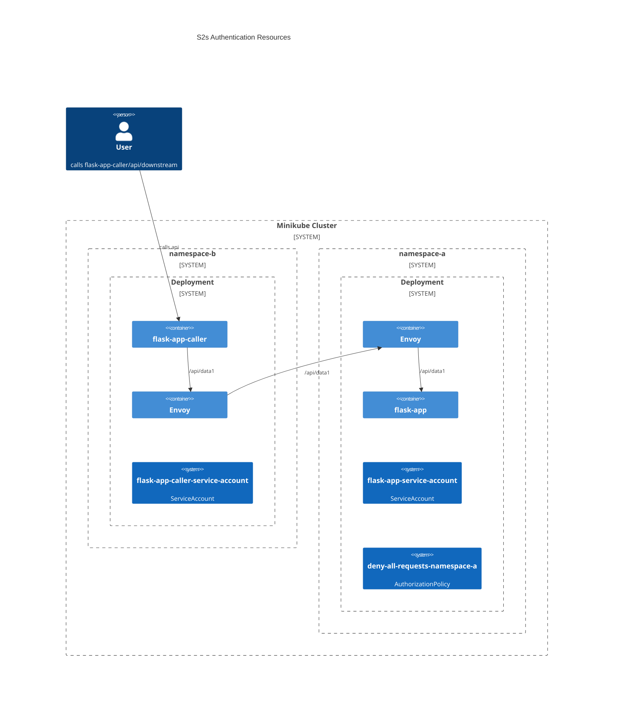

# K8s Inter Service Authorization with Istio




### Setup
```sh
# Install kubectl
curl -LO "https://dl.k8s.io/release/$(curl -L -s https://dl.k8s.io/release/stable.txt)/bin/linux/amd64/kubectl"

# Install minukube
curl -LO https://storage.googleapis.com/minikube/releases/latest/minikube_latest_amd64.deb
sudo dpkg -i minikube_latest_amd64.deb
minikube start --cpus 8 --memory 32768
minikube addons enable dashboard
minikube addons enable metrics-server
minikube dashboard

# Install istio
curl -L https://istio.io/downloadIstio | sh -
./istio-1.21.2/bin/istioctl install

# Inject istio to default namespace [Optional]
kubectl label namespace default istio-injection=enabled
# Install default istio addons [Optional]
kubectl apply -f istio-1.21.2/samples/addons/
```

### Deploy Services
```sh
# Setup local docker registry to minikube registry
eval $(minikube -p minikube docker-env)
docker build -t pritam/flask-app:latest .

```

### Apply Default Policies
```sh
kubectl apply -f flask-app.yaml 
kubectl apply -f mtls-config.yaml
```

### Allow `flask-app` -> `flask-app-caller`
```sh
curl --location 'http://localhost:9999/apply-yaml' \
--header 'Content-Type: text/plain' \
--data '---
apiVersion: security.istio.io/v1
kind: AuthorizationPolicy
metadata:
  name: flask-app-get-allow
  namespace: namespace-a
spec:
  selector:
    matchLabels:
      app: flask-app
  action: ALLOW
  rules:
  - from:
    - source:
        principals: ["flask-app-caller-service-account"]
    - source:
        namespaces: ["namespace-b"]
    to:
    - operation:
        methods: ["GET"]
        paths: ["/api/data1"]'
```

### Get all namesapce
```sh
curl --location 'http://localhost:9999/namespaces'
```

### Get workload, service-account in a namespace
```
curl --location 'http://localhost:9999/namespaces/istio-system/workloads'
```

### Temp Notes
```sh
curl http://localhost:11111/api/data1 | jq
curl http://localhost:12122/api/downstream | jq

```
### To check mtls, check headers:
`X-Forwarded-Client-Cert` : By=spiffe://cluster.local/ns/namespace-a/sa/default;Hash=d3cb02a89bb6b3de8917856c8c5a6f12aaa100c8cb4afa862078f2ce49507e1d;Subject="";URI=spiffe://cluster.local/ns/namespace-b/sa/default


